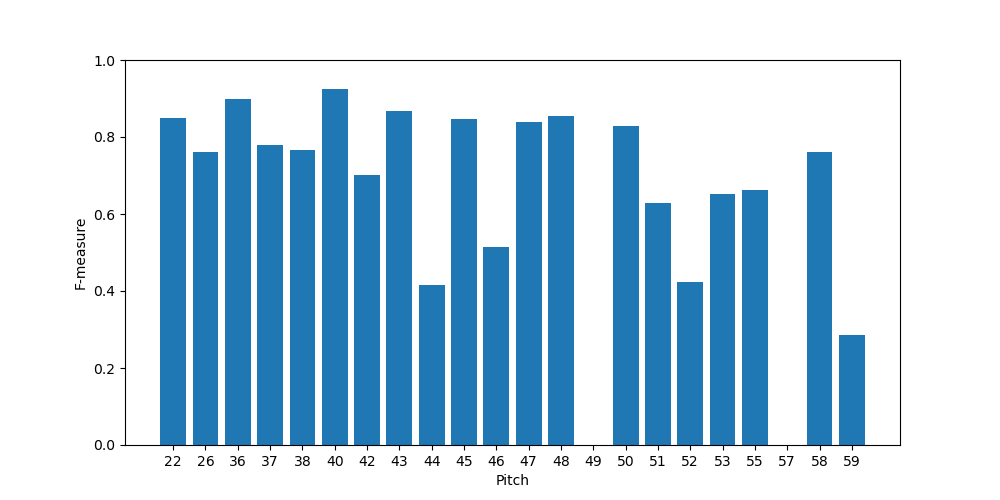

# Drumtranscript
This project is a practice project for ML class. It aims at automatic drum music transcript which transform the drum music from a wave to MIDI. 

## Prerequisites
* Python 3.7
* [Magenta](https://github.com/tensorflow/magenta)

Installation:
```
pip install magenta
```
If use GPU (Optional):
```
pip install magenta-gpu
```
## Usage
The files are organized as follows:
* main.py: Entry for the program.
* config.py: Settings for the dataset and model.
* model.py: Define the model and training/testing logic.
* data.py: Dataset preprocessing and data processing.
* utils.py: Some utility functions.

Arguments for ``main.py``:
```
usage: main.py [-h] --task {pre,train,test,trans}
               [--model {BiLSTM,OaF_Drum,SimpleDNN,SimpleLSTM}]
               [--model_path MODEL_PATH] [--input INPUT] [--output OUTPUT]
               [--threshold THRESHOLD]

Transcribe the drum solo from a wave file to a midi file.

optional arguments:
  -h, --help            show this help message and exit
  --task {pre,train,test,trans}, -t {pre,train,test,trans}
                        The task you want to execute. pre: preprocess the
                        dataset; train: train the model; test: test the model
                        performance on testset; trans: transcibe using a
                        trained model.
  --model {BiLSTM,OaF_Drum,SimpleDNN,SimpleLSTM}, -m {BiLSTM,OaF_Drum,SimpleDNN,SimpleLSTM}
                        The type of model used.
  --model_path MODEL_PATH, -p MODEL_PATH
                        The model file used for 'trans' and 'test'.
  --input INPUT, -i INPUT
                        The wave input file for transcribe, only useful when
                        task being 'trans'.
  --output OUTPUT, -o OUTPUT
                        The midi output file for transcribe, only useful when
                        task being 'trans'.
  --threshold THRESHOLD, -T THRESHOLD
                        The threshold for transcibe, only useful when task
                        being 'trans'.
```

Typical usages of the program:

1.Set the ``config.py``, only for tasks other than ``trans``. 
  - ``TFDS_DATA_DIR``: path to save the dataset.
  - ``SEQ_SAMPLE_PATH``: path to save the preprocessed samples.
  - ``FRAME_TIME``: The time of a frame used in millisecond(ms).
  - ``USE_SYNTH_AUDIO``: Bool flag, set ``True`` to use synthesized audio.
  - ``USE_MIXUP``: Bool flag, set ``True`` to use mixup audio.
  - ``SPECTROGRAM``: Bool flag, set ``True`` to use mel spectrogram feature.
  - ``NUM_EPOCHS``: Number of maxiumum epochs used for training.
  - ``BATCH_SIZE``: Default batch size used for training.

2. Preprocess the dataset
```
python main.py -t pre
```
3. Train the model, e.g. SimpleLSTM, the script will create folders ``models/LSTM`` and save the trained model under the path.
```
python main.py -t train -m SimpleLSTM
```
4. Evaluate the model on the dataset, e.g. SimpleLSTM.
```
python main.py -t test -m SimpleLSTM -p path_to_savedModel.h5
```
5. Transcribe a solo drum music to MIDI.
```
python main.py -t trans -m SimpleLSTM -p path_to_savedModel.h5 -i input.wav -o output.mid -T <threshold>
```
## Demo
1. Download the pretrained model (``model.h5``) of modified [OaF_Drum](https://magenta.tensorflow.org/oaf-drums) and the test file (``test.wav``, a audio file from the testset of [Groove MIDI Dataset](https://magenta.tensorflow.org/datasets/groove)) from the link below.
```
https://iastate.box.com/s/3p2zb7r5822aersm4t6pp38uwoxazxvu
```
2. Run the trans task
```
python main.py -t trans -m OaF_Drum -p model.h5 -i test.wav -o test.mid -T 0.4
```
3. A ``test.mid`` MIDI file will generate which should be the same as the ``test.mid`` on the link above.

The F1-score of the pretrained model on the testing set for each pitch :

## Reference
Part of this work uses dataset from
```
Jon Gillick, Adam Roberts, Jesse Engel, Douglas Eck, and David Bamman.
"Learning to Groove with Inverse Sequence Transformations."
  International Conference on Machine Learning (ICML), 2019.
```
And model from
```
Lee Callender, Curtis Hawthorne, and Jesse Engel. "Improving Perceptual Quality
  of Drum Transcription with the Expanded Groove MIDI Dataset." 2020.
  arXiv:2004.00188.
```